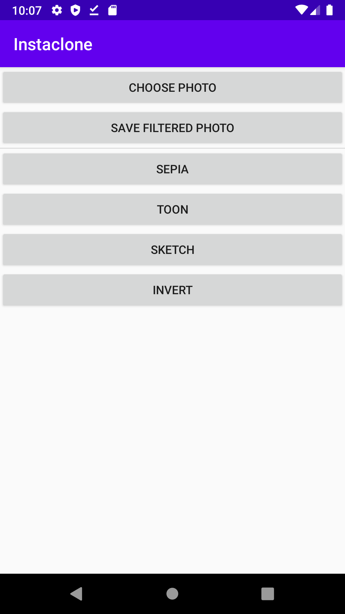

# Instaclone Android

An android app to apply [Glide Transformations](https://github.com/wasabeef/glide-transformations) image filters and save filtered images. Creating following [Harvard's CS50 Android track](https://cs50.harvard.edu/x/2020/tracks/mobile/android/fiftygram/).

